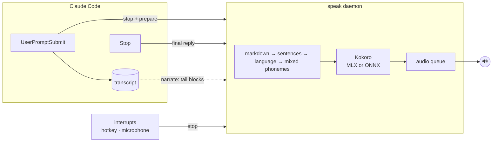

<div align="center">

# speak

**Local, instant voice for Claude Code.**

Claude reads its replies aloud with an on-device neural voice. It's fast, private, and you can interrupt it at any time.


</div>

---

## Install

```sh
claude plugin marketplace add Jibaru/speak && claude plugin install speak@jibaru
```

That's it. Start a new Claude Code session and Claude will talk back.

The first session sets up the voice engine in the background (an isolated Python, the locked dependencies
and the voice model, all under `~/.cache/speak`). Until it's ready, replies are spoken with the system voice
(`say` on macOS, SAPI on Windows), so you never wait in silence. To download everything up front instead:

```sh
~/.claude/plugins/cache/jibaru/speak/*/bin/speak install
```

Then check that everything works on your machine:

```sh
~/.claude/plugins/cache/jibaru/speak/*/bin/speak doctor
```

| Platform | Engine | Notes |
|---|---|---|
| macOS · Apple Silicon | Kokoro on MLX (GPU) | ~100–200 ms to first audio |
| macOS · Intel, Linux, Windows | Kokoro on ONNX Runtime (CPU, or CUDA / DirectML when present) | ~0.3–0.6 s on a modern CPU |

> No Homebrew, system Python, compiler or admin rights required. On Windows, `bin/speak.cmd` is used from
> `cmd`/PowerShell and `bin/speak` from Git Bash.

## Features

- **Always speaks.** Hooks drive the voice, so it doesn't depend on Claude remembering to call a tool.
- **Fast.** First audio arrives in ~100–250 ms on Apple Silicon. A warm daemon keeps the model in memory.
- **Cross-platform.** macOS, Windows and Linux, with the same commands and hooks.
- **Text stays the same.** Voice is added on top; nothing in the transcript changes.
- **Interruptible.** A new prompt, a global hotkey, the microphone opening or Esc all stop it.
- **Multilingual.** Each sentence is spoken in its own language, and tech jargon inside Spanish sentences is pronounced properly.
- **Private.** Synthesis happens on your Mac. After the one-time download, nothing goes over the network.
- **Session-aware.** One audio queue across every Claude Code window. The newest reply wins, and the project name is announced when several are active.

## Levels

| Level | What you hear |
|---|---|
| `off` | Nothing |
| `brief` *(default)* | A one or two sentence spoken summary that Claude writes at the top of its reply |
| `full` | The whole final reply. Code blocks, tables and links become a short phrase |
| `narrate` | Everything Claude writes while it works, as it writes it, plus permission prompts |

## Commands

| Command | Effect |
|---|---|
| `/speak` | Show the current level and engine status |
| `/speak off \| brief \| full \| narrate` | Set the level for this session |
| `/speak default <level>` | Set the default level for new sessions |
| `/speak rate <0.5–2.0>` | Set the speaking rate (default `1.15`) |
| `/speak voice <lang> <voice>` | Pick a voice, e.g. `/speak voice es em_alex` |
| `/speak engine <name>` | `auto`, `kokoro-mlx` or `kokoro-onnx` |
| `/speak stop` | Stop speaking |
| `/speak test` | Play a short sample |

`/speak` is handled by a hook, so it never costs a model turn.

## Interrupting

| Action | macOS | Windows | Linux |
|---|---|---|---|
| Send a new prompt | ✓ | ✓ | ✓ |
| Global hotkey | **⌥ Esc** | **Ctrl Alt Esc** | **Ctrl Alt Esc** on X11 ¹ |
| Dictate with `/voice`, or any app opens the mic | ✓ CoreAudio | ✓ privacy registry | ✓ PulseAudio / PipeWire |
| **Esc** to interrupt Claude mid-turn (`narrate`) | ✓ | ✓ | ✓ |

No Accessibility or admin permission is needed. Change the hotkey with `"hotkey"` in the config.

¹ Wayland doesn't let apps register global shortcuts. Bind `~/.claude/plugins/cache/jibaru/speak/*/bin/speak stop`
to a keyboard shortcut in your desktop settings instead.

## Languages

English, Spanish, French, Italian and Portuguese are detected **per sentence**, so a reply that switches
languages also switches voices.

Inside a sentence, **English words keep their English pronunciation**. "Hice el *deploy* del *hook* en
*TypeScript*" is read by the Spanish voice, but `deploy`, `hook` and `TypeScript` are phonemized as English,
like a bilingual developer would say them. Words are classified with word-frequency lists, spelling cues
(`k`, `w`, `sh`, `-ing`…) and camelCase. Spanish uses Latin American pronunciation.

Tune it in `~/.config/speak/lexicon.json`:

```json
{
  "english": ["Kubernetes", "rollout"],
  "native": ["red"],
  "es": { "SQL": "ese cu ele" }
}
```

`english` and `native` force how a word is classified, and per-language entries respell a word.

## Configuration

`~/.config/speak/config.json` (every key is optional):

```json
{
  "level": "brief",
  "engine": "auto",
  "rate": 1.15,
  "voices": { "en": "af_heart", "es": "ef_dora" },
  "hotkey": "option+escape",
  "stop_on_mic": true,
  "idle_minutes": 30
}
```

Voices are listed in the [Kokoro model card](https://huggingface.co/hexgrad/Kokoro-82M/blob/main/VOICES.md).
The hotkey accepts `cmd`/`win`, `option`/`alt`, `ctrl` and `shift` combined with a letter, digit, `escape`,
`space` or `f1`–`f12`.

## How it works



1. **Hooks** send each event to a local daemon over a token-protected localhost socket in ~40 ms. Claude is
   never blocked.
2. The **daemon** turns markdown into speakable sentences, picks a voice per sentence and streams audio
   as soon as the first sentence is synthesized. It exits after 30 idle minutes.
3. In `brief` mode, a hook asks Claude to open its reply with a spoken summary, and only that is read.
4. **Interrupt watchers** register the hotkey and watch the microphone: a small Swift helper on macOS,
   Win32 APIs on Windows, X11 and `pactl` on Linux.

### Performance

Measured on an M4 Pro:

| | MLX | ONNX (CPU) |
|---|---|---|
| First audio after a reply, warm | 100–200 ms | 370–560 ms |
| Synthesis speed | ~25× real time | ~8× real time |
| Hook overhead | 40–50 ms | 40–50 ms |
| Memory while running | ~620 MB | ~780 MB |

## Update and uninstall

```sh
claude plugin marketplace update jibaru && claude plugin update speak@jibaru   # update
claude plugin uninstall speak@jibaru && rm -rf ~/.cache/speak ~/.config/speak    # uninstall
```

## Troubleshooting

| Problem | Fix |
|---|---|
| No voice at all | Run `bin/speak doctor`, then check `~/.cache/speak/daemon.log` |
| Robotic voice | The engine is still installing and `say` is filling in. See `~/.cache/speak/install.log` |
| A word sounds wrong | Add it to `~/.config/speak/lexicon.json` |
| The hotkey does nothing | Another app may own it. Set a different `hotkey` in the config |
| Linux: no audio | Make sure PulseAudio or PipeWire is running; `speak doctor` shows the audio backend |

## Development

```sh
git clone https://github.com/Jibaru/speak && cd speak
uv sync && uv run pytest     # tests
helper/build.sh              # rebuild the native helper
claude --plugin-dir .        # run Claude Code with this checkout
```

## License

[MIT](LICENSE)
