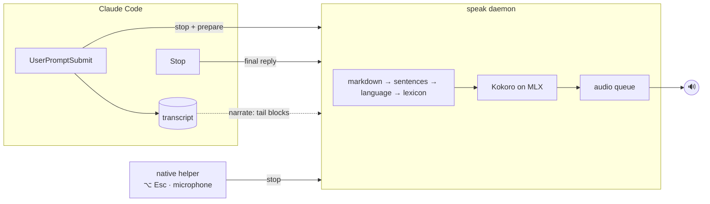

<div align="center">

# speak

**Local, instant voice for Claude Code.**

Claude reads its replies aloud with an on-device neural voice. It's fast, private, and you can interrupt it at any time.


</div>

---

## Install

```sh
claude plugin marketplace add Jibaru/speak && claude plugin install speak@jibaru
```

That's it. Start a new Claude Code session and Claude will talk back.

The first session sets up the voice engine in the background (an isolated Python, the locked dependencies
and the ~350 MB model, all under `~/.cache/speak`). Until it's ready, replies are spoken with macOS `say`,
so you never wait in silence. To download everything up front instead:

```sh
~/.claude/plugins/cache/jibaru/speak/*/bin/speak install
```

> Requires macOS on Apple Silicon and Claude Code. Homebrew, a system Python and Xcode are **not** required.

## Features

- **Always speaks.** Hooks drive the voice, so it doesn't depend on Claude remembering to call a tool.
- **Fast.** First audio arrives in ~100–250 ms. A warm daemon keeps the model in memory.
- **Text stays the same.** Voice is added on top; nothing in the transcript changes.
- **Interruptible.** A new prompt, a global hotkey, the microphone opening or Esc all stop it.
- **Multilingual.** Each sentence is spoken in its own language, and tech jargon inside Spanish sentences is pronounced properly.
- **Private.** Synthesis happens on your Mac. After the one-time download, nothing goes over the network.
- **Session-aware.** One audio queue across every Claude Code window. The newest reply wins, and the project name is announced when several are active.

## Levels

| Level | What you hear |
|---|---|
| `off` | Nothing |
| `brief` *(default)* | A one or two sentence spoken summary that Claude writes at the top of its reply |
| `full` | The whole final reply. Code blocks, tables and links become a short phrase |
| `narrate` | Everything Claude writes while it works, as it writes it, plus permission prompts |

## Commands

| Command | Effect |
|---|---|
| `/speak` | Show the current level and engine status |
| `/speak off \| brief \| full \| narrate` | Set the level for this session |
| `/speak default <level>` | Set the default level for new sessions |
| `/speak rate <0.5–2.0>` | Set the speaking rate (default `1.15`) |
| `/speak voice <lang> <voice>` | Pick a voice, e.g. `/speak voice es em_alex` |
| `/speak stop` | Stop speaking |
| `/speak test` | Play a short sample |

`/speak` is handled by a hook, so it never costs a model turn.

## Interrupting

| Action | Stops speech |
|---|---|
| Send a new prompt | ✓ |
| Press **⌥ Esc**, from any app | ✓ |
| Hold Space to dictate with `/voice`, or any app opens the mic | ✓ |
| Press **Esc** to interrupt Claude mid-turn (`narrate`) | ✓ |

The hotkey uses the system hotkey API, so it doesn't need Accessibility permission.

## Languages

English, Spanish, French, Italian and Portuguese are detected **per sentence**, so a reply that switches
languages also switches voices. Spanish sentences full of English jargon (`deploy`, `hook`, `TypeScript`,
`useEffect`…) are respelled so they sound natural.

Add your own respellings in `~/.config/speak/lexicon.json`:

```json
{ "es": { "Kubernetes": "cubernetis", "Vercel": "vérsel" } }
```

## Configuration

`~/.config/speak/config.json` (every key is optional):

```json
{
  "level": "brief",
  "rate": 1.15,
  "voices": { "en": "af_heart", "es": "ef_dora" },
  "hotkey": "option+escape",
  "stop_on_mic": true,
  "idle_minutes": 30
}
```

Voices are listed in the [Kokoro model card](https://huggingface.co/hexgrad/Kokoro-82M/blob/main/VOICES.md).
The hotkey accepts `cmd`, `option`, `ctrl` and `shift` combined with a letter, `escape`, `space` or `f1`–`f12`.

## How it works



1. **Hooks** send each event to a local daemon over a Unix socket in ~40 ms. Claude is never blocked.
2. The **daemon** turns markdown into speakable sentences, picks a voice per sentence and streams audio
   as soon as the first sentence is synthesized. It exits after 30 idle minutes.
3. In `brief` mode, a hook asks Claude to open its reply with a spoken summary, and only that is read.
4. A small **Swift helper** registers the hotkey and watches the microphone through CoreAudio.

### Performance

Measured on an M4 Pro:

| | |
|---|---|
| First audio after a reply, warm | 98–270 ms |
| First audio after the daemon starts | ~150 ms |
| Hook overhead | 40–50 ms |
| Synthesis speed | ~25× faster than real time |
| Memory while running | ~600 MB |

## Update and uninstall

```sh
claude plugin marketplace update jibaru && claude plugin update speak@jibaru   # update
claude plugin uninstall speak@jibaru && rm -rf ~/.cache/speak ~/.config/speak    # uninstall
```

## Troubleshooting

| Problem | Fix |
|---|---|
| No voice at all | `~/.claude/plugins/cache/jibaru/speak/*/bin/speak status`, then check `~/.cache/speak/daemon.log` |
| Robotic voice | The engine is still installing and `say` is filling in. See `~/.cache/speak/install.log` |
| A word sounds wrong | Add it to `~/.config/speak/lexicon.json` |
| ⌥ Esc does nothing | Another app may own the shortcut. Set a different `hotkey` in the config |

## Development

```sh
git clone https://github.com/Jibaru/speak && cd speak
uv sync && uv run pytest     # tests
helper/build.sh              # rebuild the native helper
claude --plugin-dir .        # run Claude Code with this checkout
```

## License

[MIT](LICENSE)
